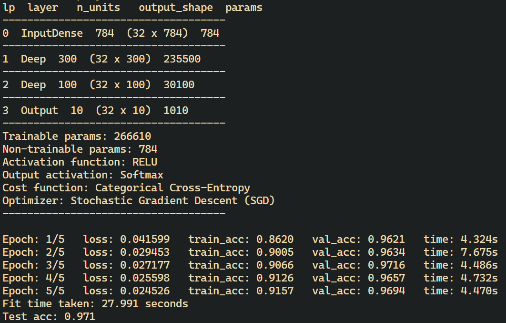

# Neural Network in C language

This project is an implementation of basic DNN and CNN in C programming laguage from scratch. I am using my own linear algebra library for matrix and tensor operations.

At the moment, only the DNN is fully functional (can use every optimizer) and optimized. CNN is working, but is not optimized and very slow.

## Compiliation

System: Ubuntu 22.04 LTS (Windows Subsystem for Linux).

To compile project files, I recommend using

``` bash
gcc -Iinclude src/*.c main.c -o neuralnet -lm -O3 -march=native -ffast-math -funroll-loops -fopenmp 
```

After compilation simpy run program using

``` bash
./neuralnet
```

## Examples

### Loading data (binary)

``` c
Matrix* x_train = load_ubyte_images("data/mnist/train-images-idx3-ubyte");
Matrix* x_test = load_ubyte_images("data/mnist/test-images-idx3-ubyte");
Matrix* y_train = load_ubyte_labels("data/mnist/train-labels-idx1-ubyte");
Matrix* y_test = load_ubyte_labels("data/mnist/test-labels-idx1-ubyte");
```

### Preprocessing

```c
// normalization
normalize(x_train); 
normalize(x_test);

// one hot encoding
matrix_assign_ptr(&y_train, one_hot_encode(y_train, 10));
matrix_assign_ptr(&y_test, one_hot_encode(y_test, 10));

// shuffling
srand(time(NULL));
shuffle_matrix_inplace(x_train, y_train);
shuffle_matrix_inplace(x_test, y_test);
```

### Initializing neural network

```c
NeuralNet* net = neural_net_new(
    optimizer_sgd_new(0.01), // optimizer
    RELU, 1.0, // activation func and param (optional)
    CAT_CROSS_ENTROPY, // loss function
    32 // batch size
);
```

### Adding layers and compiling

```c
add_input_layer(x_train->n_cols, net);
add_deep_layer(300, net);
add_deep_layer(100, net);
add_output_layer(y_train->n_cols, net);

neural_net_compile(net);
```

### Printing network info

```c
neural_net_info(net);
```

### Training model

```c
struct timeval start, end;
gettimeofday(&start, NULL);
fit(x_train, y_train, 5, 0.1, net);
gettimeofday(&end, NULL);
double fit_time = (end.tv_sec - start.tv_sec) + (end.tv_usec - start.tv_usec) / 1e6;

printf("Fit time taken: %.3f seconds\n", fit_time);

score(x_test, y_test, net);
confusion_matrix(x_test, y_test, net);
```


