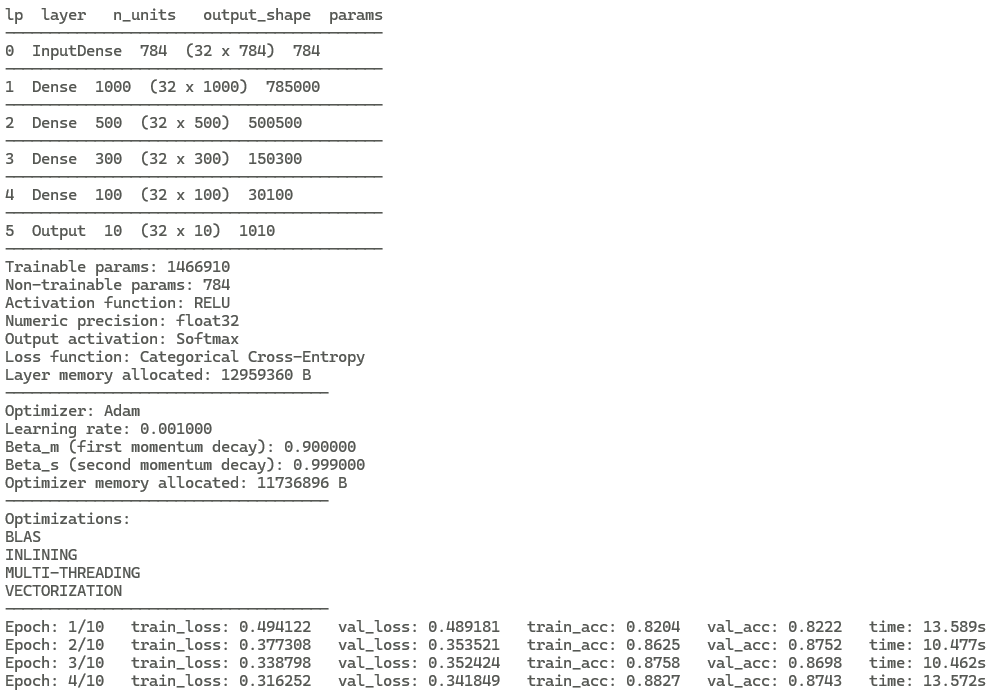
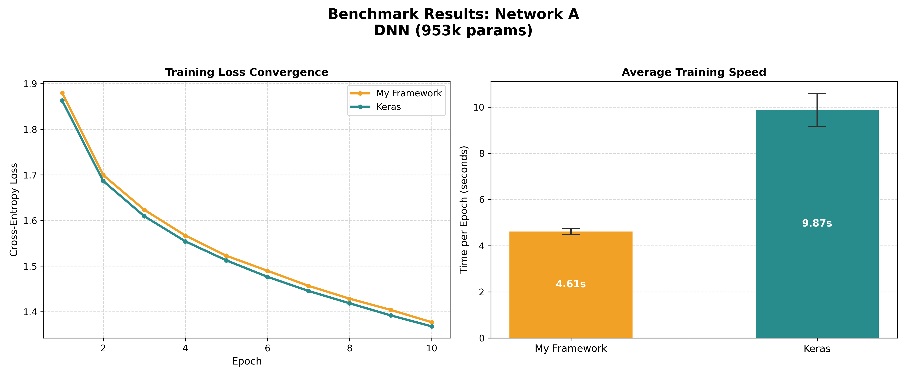
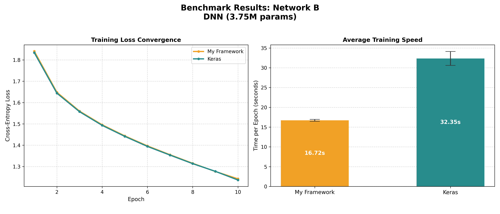
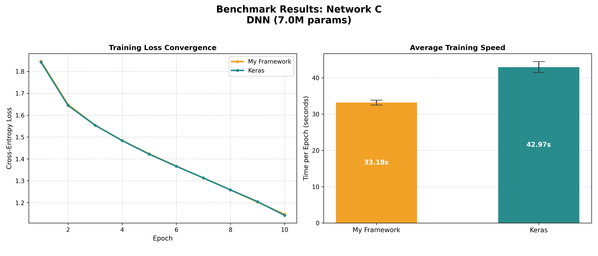
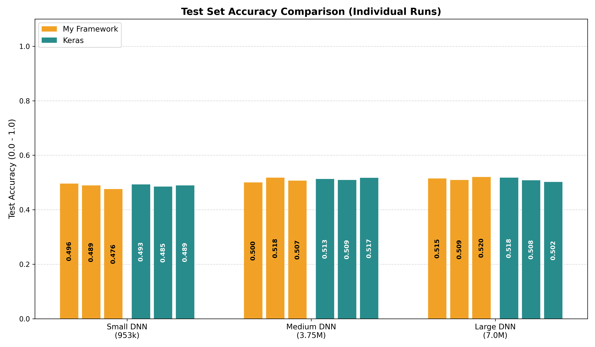
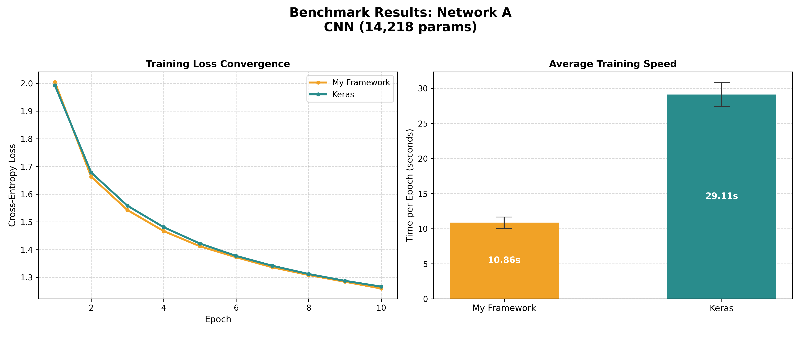
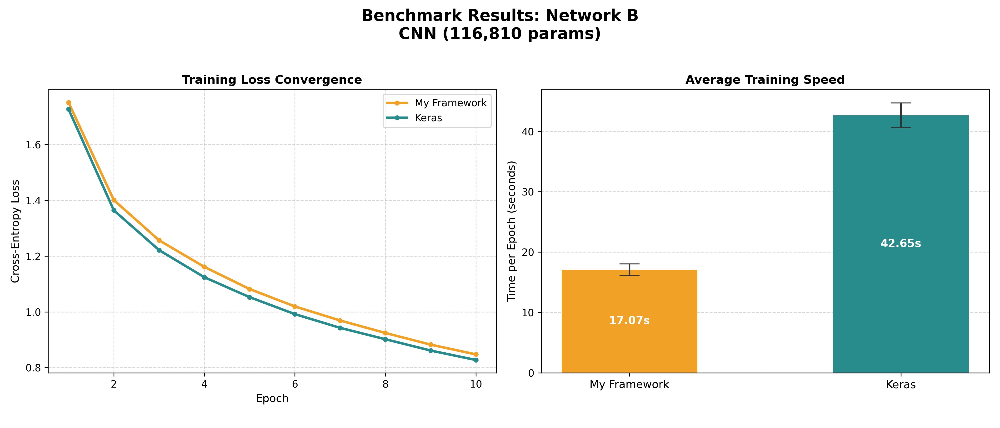
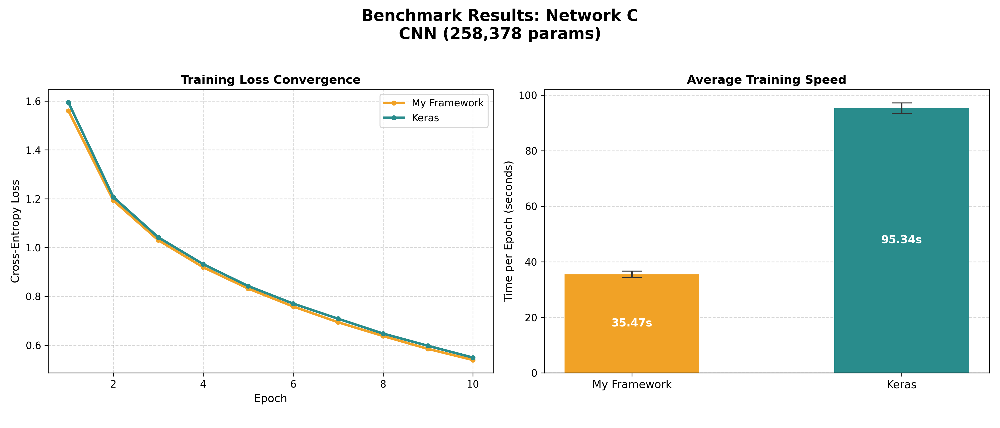
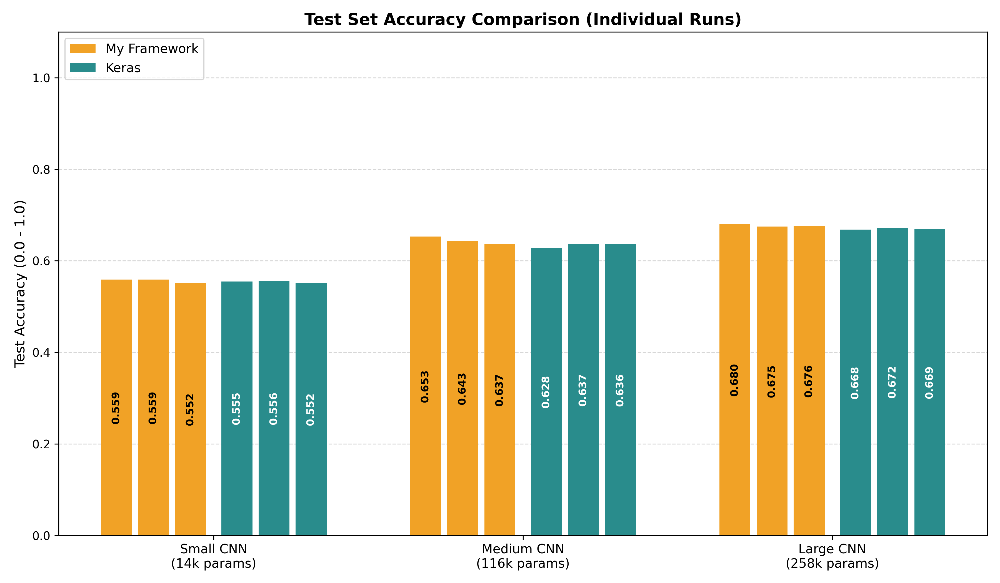

# Neural Network in C language

This project is an implementation of basic DNN and CNN in C programming laguage from scratch.

## Compiliation

System: Ubuntu 22.04 LTS (Windows Subsystem for Linux).

To compile project files, I recommend using

``` bash
gcc -Iinclude src/*.c main.c -o neuralnet -O3 -lm -march=native -ffast-math -funroll-loops -fopenmp -lopenblas -mfma -mavx2 -flto
```

After compilation simpy run program using

``` bash
./neuralnet
```

## Examples

### Loading data (binary) and initial config

``` c
openblas_set_num_threads(4);
srand(time(NULL));

Matrix* x_train = load_ubyte_images("data/fashion_mnist/train-images-idx3-ubyte");
Matrix* x_test = load_ubyte_images("data/fashion_mnist/test-images-idx3-ubyte");
Matrix* y_train = load_ubyte_labels("data/fashion_mnist/train-labels-idx1-ubyte");
Matrix* y_test = load_ubyte_labels("data/fashion_mnist/test-labels-idx1-ubyte");
```

### Defined optimizations in config.h

```c
#define BLAS
#define SINGLE_PRECISION
#define INLINE
#define CACHE_LOCALITY
#define VECTORIZATION
// MUTLI_THREADING is off because openblas_set_num_threads is already set to 4
// #define MULTI_THREADING
```

### Preprocessing

```c
// normalization
normalize(x_train); 
normalize(x_test);

// one hot encoding
Matrix* y_train_onehot = one_hot_encode(y_train, 10);
Matrix* y_test_onehot = one_hot_encode(y_test, 10);

// shuffling
shuffle_matrix_inplace(x_train, y_train_onehot);
shuffle_matrix_inplace(x_test, y_test_onehot);
```

### Initializing neural network

```c
NeuralNet* net = neural_net_new(
    optimizer_adam_new(0.001, 0.9, 0.999), // optimizer
    RELU, 0.01, // activation function and optional activation param 
    CAT_CROSS_ENTROPY // loss function, 
    32 // batch size
);
```

### Adding layers and compiling

```c
add_input_layer(x_train->n_cols, net);
add_dense_layer(1000, net);
add_dense_layer(500, net);
add_dense_layer(300, net);
add_dense_layer(100, net);
add_output_layer(y_train_onehot->n_cols, net);
neural_net_compile(net);
```

### Printing network info

```c
neural_net_info(net);
```

### Training model

```c
fit(x_train, y_train_onehot, 10, 0.1, net);
score(x_test, y_test_onehot, net);
confusion_matrix(x_test, y_test_onehot, net);
```



## Results

DNN Comparison with Keras using CIFAR-10 dataset






CNN comparison with Keras using CIFAR-10 dataset





